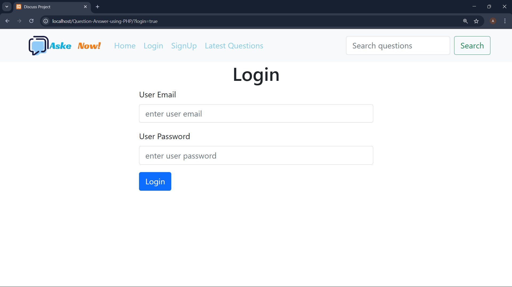

# 💬 Aske Now | PHP Q&A Forum

A simple and functional **Question & Answer** web application built using **PHP**, **MySQL**, **Bootstrap**, and **XAMPP**. Users can sign up, log in, ask questions, post answers, and view discussions in categorized format.

---

## 🚀 Features

- 🧑‍💻 User Authentication (Signup/Login)
- ❓ Post and view questions
- 💡 Submit and display answers
- 📂 Category-based filtering
- 🔎 Search functionality
- ⏰ Time-stamped entries
- 💾 Built on MySQL + PHP (XAMPP environment)

---

## 🖼️ Screenshots

| Login Page | Question List |chr
|------------|----------------|
|  |  |

---

## 📁 Project Structure

```
Ask-Questions-Using-PHP/
├── client/
│ ├── ask.php
│ ├── answers.php
│ ├── header.php
│ ├── login.php
│ ├── questions.php
│ ├── question-details.php
│ └── signup.php
├── common/
│ └── db.php
├── server/
│ └── requests.php
├── public/
│ └── logo.png
├── index.php
└── README.md

```

## ⚙️ Installation Guide

### 1. Clone the Repository

```bash
git clone https://github.com/itsAnurag27/Ask-Questions-Using-PHP.git
cd Ask-Questions-Using-PHP
 
```
### 2. Move to XAMPP htdocs Directory
```
# Example path
C:\xampp\htdocs\demo\
```
### 3. Start Apache & MySQL in XAMPP
Open XAMPP Control Panel

Click Start for both Apache and MySQL

### 4. Import the Database
Open phpMyAdmin → Create a DB named discuss

Run the provided SQL script to create tables and insert sample data

```
-- create database discuss;
-- use discuss;

CREATE TABLE users (
    id INT AUTO_INCREMENT PRIMARY KEY,
    username VARCHAR(100) NOT NULL,
    email VARCHAR(100) NOT NULL UNIQUE,
    password VARCHAR(255) NOT NULL,
    address VARCHAR(255),
    created_at TIMESTAMP DEFAULT CURRENT_TIMESTAMP
);

CREATE TABLE category (
    id INT AUTO_INCREMENT PRIMARY KEY,
    name VARCHAR(100) NOT NULL
);

CREATE TABLE questions (
    id INT AUTO_INCREMENT PRIMARY KEY,
    title VARCHAR(255) NOT NULL,
    description TEXT,
    category_id INT,
    user_id INT,
    created_at TIMESTAMP DEFAULT CURRENT_TIMESTAMP,
    FOREIGN KEY (category_id) REFERENCES category(id),
    FOREIGN KEY (user_id) REFERENCES users(id)
);

CREATE TABLE answers (
    id INT AUTO_INCREMENT PRIMARY KEY,
    answer TEXT NOT NULL,
    question_id INT,
    user_id INT,
    created_at TIMESTAMP DEFAULT CURRENT_TIMESTAMP,
    FOREIGN KEY (question_id) REFERENCES questions(id) ON DELETE CASCADE,
    FOREIGN KEY (user_id) REFERENCES users(id) ON DELETE SET NULL
);

```
### 5. Run the Project
Open your browser and navigate to:

http://localhost/your-filename/

### 🛠️ Tech Stack

| Language  | Role               |
| --------- | ------------------ |
| PHP       | Server-side Logic  |
| MySQL     | Database           |
| HTML/CSS  | Frontend           |
| Bootstrap | Styling            |
| Apache    | Server (via XAMPP) |


### 📝 License
This project is for educational use. You can use, modify, and share it freely.

### ⭐ Suggestions
Add comment system for answers

Admin dashboard for moderation

Email verification during signup

Pagination on question list

#### 💡 Feel free to fork and improve this project. Pull requests are welcome!